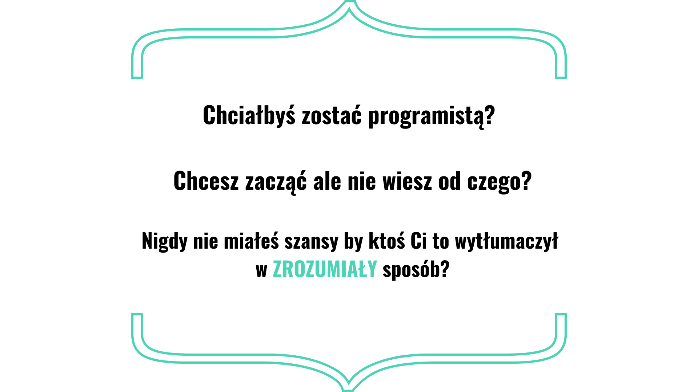
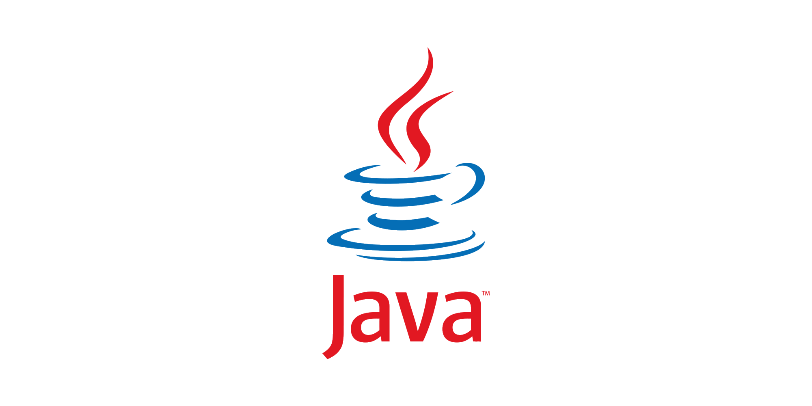

# Nauka Java od podstaw!

 

 Doskonale! Zatem ten projekt jest stworzony specjalnie dla Ciebie!

 

Możesz zacząć od zaraz! Aby zacząć ten kurs nie musisz się przygotowywać. Nie musisz przeczytać żadnej książki, ani skończyć żadnych studiów. Nie wydasz również ani złotówki na drogie oprogramowanie czy licencje! 

Znajdziesz tutaj mnóstwo lekcji, które omawiają podstawowe zagadenia w najprostszy możliwy sposób!    

##Czego dokładnie się nauczysz?
* stosowania komentarzy
* metoda ***main***, ***klasy*** i ***metody***
* rodzaje ***zmiennych*** w Java oraz zakres ich działania
* typy wyliczeniowe, czyli ***enum***
* typy generyczne
* programowanie obiektowe
* wątki
* interfejsy i klasy abstrakcyjne
* konstruktory
* operacje matematyczne
* operacje na tekście - ***String***
* Warunki logiczne ***if-else*** oraz ***switch-case***
* Pętle ***for***, ***for-each***, ***while***, ***do-while***
* tablice, listy i zbiory
* mapy
* wyjątki zwykłe i typu ***Runtime***
* obsługa wyjątku ***try-catch*** oraz ***try-catch-final***

## Instrukcja i założenia
### YouTube
Materiały które tutaj będę umieszczał są nieodłączną częścią mojej serii filmów poświęconej Java na [YouTube](https://www.youtube.com/c/AnatomiaKodu), dlatego koniecznie obejrzyj nagranie najpierw zanim zerkniesz do kodu z danej lekcji.

### Facebook
Dołącz do naszej grupy wsparcia na [Facebook](https://www.facebook.com/groups/jak.zostac.programista.2). Tam możesz zadawać pytania i wymieniać się wiedzą.

## CONTENT
### Zanim zaczniesz:
- [Jaki wybrać język programowania?](https://www.youtube.com/watch?v=NvMyhQPUrbo&t=2s&ab_channel=AnatomiaKodu)
- [Czym jest Java i jak jest zbudowana?](https://www.youtube.com/watch?v=bfB4H61K2Lk&t=2s&ab_channel=AnatomiaKodu)
- [Czym jest IDE? Jak używać IntelliJ IDEA?](https://www.youtube.com/watch?v=cqtN7eLD5yU&t=234s&ab_channel=AnatomiaKodu)
### LEKCJE:
1. Pierwsza aplikacja w Java. Metoda main

## Kim jestem?

Nazywam się Michał Ćwiękała i jestem zawodowym programistą od ponad 7 lat. Skończyłem Informatykę na Politechnice Śląskiej, a z komputerem mam styczność odkąd tylko pamiętam. Moją misją jest pomagać innym w rozwoju swojej kariery w branży IT.
 
Możesz mnie śledzić tutaj:

[Facebook](https://www.facebook.com/AnatomiaKodu)  
[Youtube](https://www.youtube.com/c/AnatomiaKodu)  
[Instagram](https://www.instagram.com/anatomiakodu/)  
[Strona www](https://anatomiakodu.pl/)  
[Spotify](https://open.spotify.com/show/3aXS6JAvx91eApuUZ9O7XA)

    

