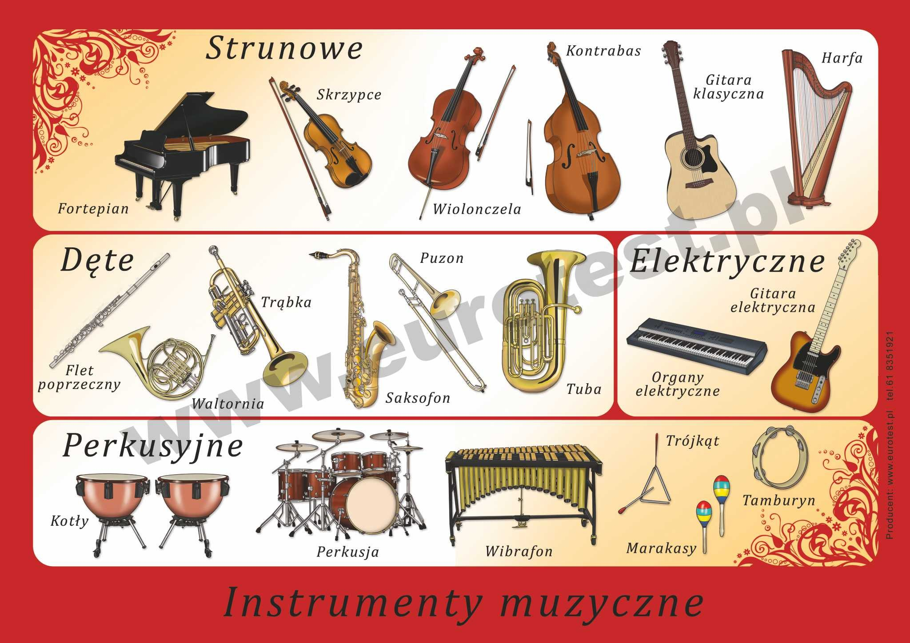
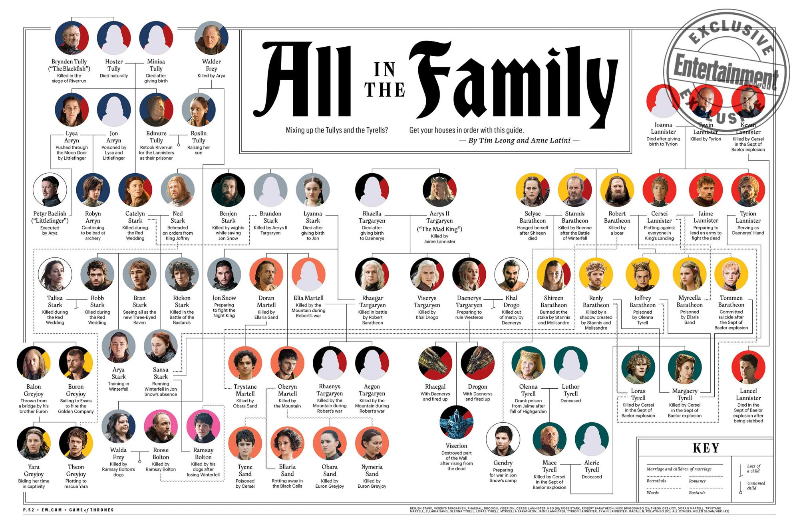

    
      

1. Stwórz hierarchię klas dla różnych rodzajów instrumentów. Stwórz odpowiednie metody i nadpisz ich zachowanie. Użyj `final` gdy nie spodziewasz się potomków. 

  
(źródło: https://eurotest.pl/home/121-instrumenty-muzyczne.html)

2. Stwórz hierarchię klas na podstawie drzewa genealogicznego z "Gry o Tron". Zastanów się nad odpowiednią abstrakcją. Możesz np. użyć klas takich jak `Human`, `Stark`, `Lannister`, `Targaryen`. Każda osoba powinna mieć nazwę, status czy żyje i miejsce na dodatkową informację. Każda z osób powinna również mieć referencję do matki i ojca.

  
(źródło: https://ew.com/tv/2019/03/20/game-of-thrones-family-tree/)

3. Wykorzystaj powyższe przykłady do rzutowania z najwyższego parenta do najbardziej szczegółowej klasy.

       
    

