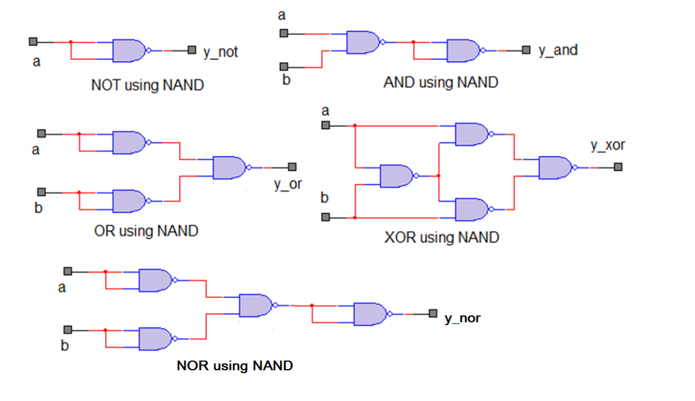

    
      

1. Oblicz ilość niedziel w 2022 roku.
2. Oblicz w jaki dzień tygodnia się urodziłeś.
3. Stwórz metodę która będzie zwracać resztę z dzielenia zmienej x przez 7.
4. Spróbuj stworzyć w Javie przedstawione warunkiu logiczne dla zmiennej a i b:

(https://www.microcontrollertips.com/what-are-basic-logic-gates-faq/)

5. Stwórz metodę która będzie porównywać zmienną typu int do liczby 10 i jako odpowiedź zwróci tekst:
    - Jest większe niż 10.
    - Jest mniejsze od 10.
    - Jest równe 10.

       
    

