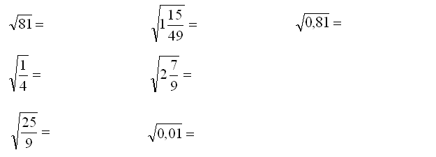

    
      

1. Użyj Java by rozwiązać następujące równania:

(https://www.math-exercises.com/new/equations-and-inequalities/trigonometric-equations-and-inequalities)

2. Stwórz metodę która będzie generowała liczbę od -3 do 1.
 
3. Wejdź na stronę z dokumentacją Java i użyj kilku metod klasy `Math` które nie zostały omówione w tym materiale.

       
    

